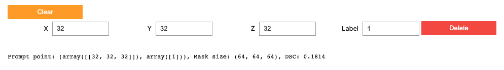

# CT-SAM3D Inference Pipeline
<!-- Towards a Comprehensive, Efficient and Promptable Anatomic Structure Segmentation Model using 3D Whole-body CT Scans. -->
> Author: Tianyu Lin

## News
- Update 09/29/2024:
  - [x] Sample point prompt(s) from postprocessed pseudo label for automatic segmentation:
    1. Get pseudo label from a pretrained segmentation model
    2. Conduct DAPAtlas postprocessing or my postprocessing method on pseudo label
    3. Sample a single point for each pseudo label as prompt for CT-SAM3D segmentation
    - Inference code in: `./ct_sam/notebooks/point2seg.ipynb`
- Update 09/22/2024:
  - [x] set environment 
  - [x] build test sample: can add dots and get Dice result
  - ~~[ ] visualization: NO VISUALIZATION~~
      



## Overview


## Installation
```bash
git clone https://github.com/henguo/ct-sam3d.git
cd ct-sam3d
pip install -e .
# install the official itkwidgtes to get the 'imjoy-jupyterlab-extension' ready
pip install 'itkwidgets[lab]==1.0a49'
# install the customized interactive tool
pip install git+https://github.com/henguo/itkwidgets.git
pip install numpy==1.22.4
```

## Download Model
Please download our model from 🤖️[ModelScope](https://modelscope.cn/models/xiuan123/CT-SAM3D).

## Quick Start
Please start your interactive segmentation journey from our [Notebook](ct_sam/notebooks/visualization.ipynb).

Tool Usage
```
Left-click to add a positive point, and right-click to add a negative point.
```
## Demo


## License
CT-SAM3D is released under the Apache 2.0 license.

## Citation
If you find this project useful in your research, please cite the following paper:
```
@misc{guo2024ctsam3d,
      title={Towards a Comprehensive, Efficient and Promptable Anatomic Structure Segmentation Model using 3D Whole-body CT Scans}, 
      author={Heng Guo and Jianfeng Zhang and Jiaxing Huang and Tony C. W. Mok and Dazhou Guo and Ke Yan and Le Lu and Dakai Jin and Minfeng Xu},
      year={2024},
      eprint={2403.15063},
      archivePrefix={arXiv},
      primaryClass={cs.CV},
      url={https://arxiv.org/abs/2403.15063}, 
}
```

## Acknowledgements
This code is based on the implementations of [SAM](https://github.com/facebookresearch/segment-anything), [ResT](https://github.com/wofmanaf/ResT), [SPADE](https://github.com/NVlabs/SPADE), and [itkwidgets](https://github.com/InsightSoftwareConsortium/itkwidgets). We are profoundly grateful for these exceptional and inspiring works！